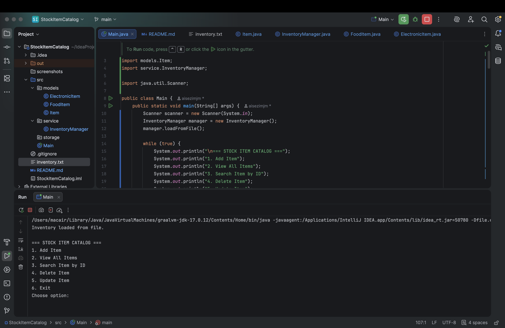
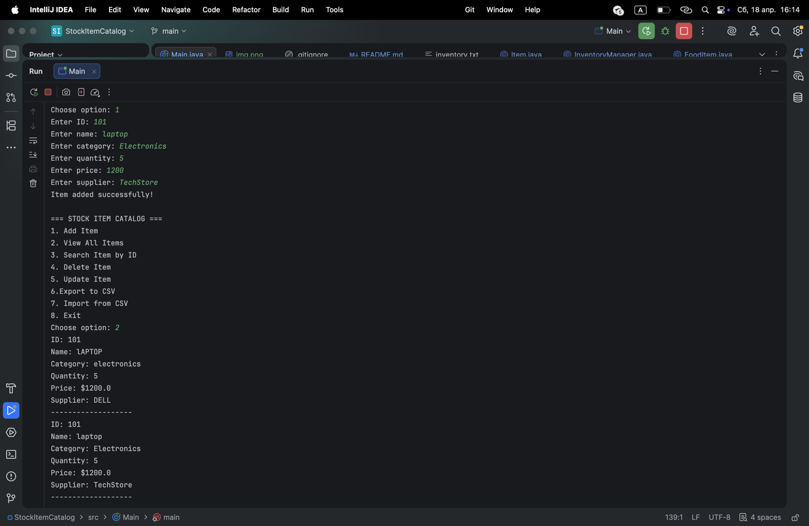
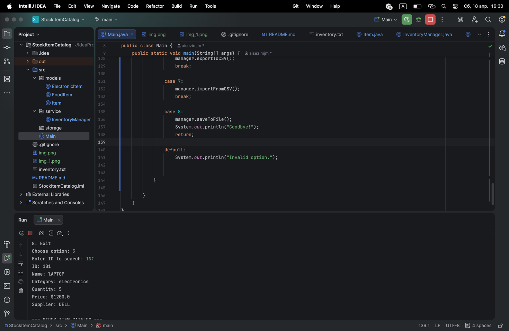
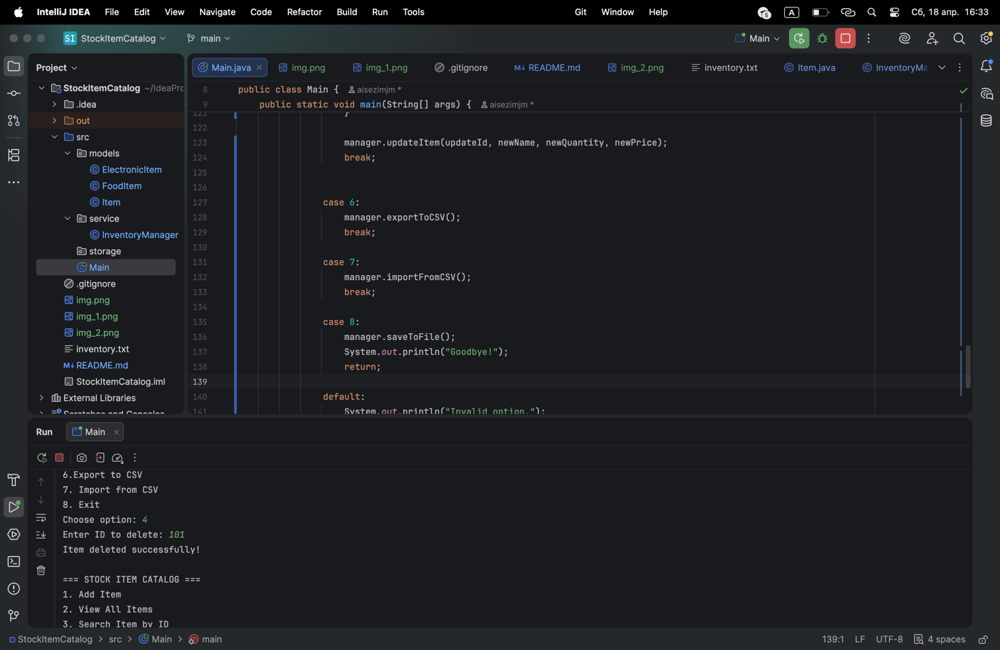
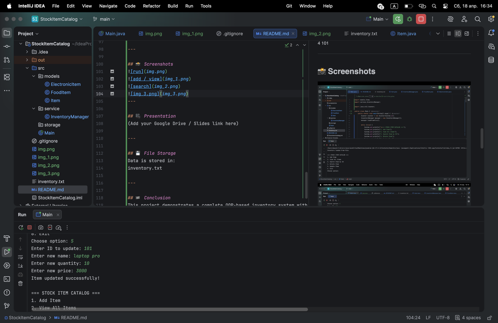
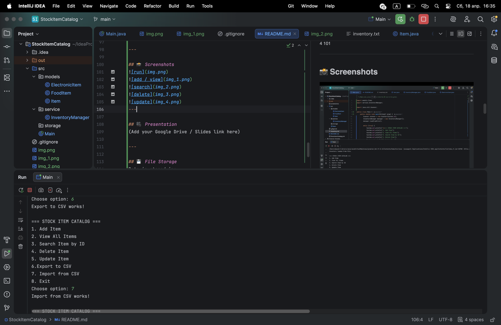

# 📦 Stock Item Catalog System

## 👩‍💻 Student
Batyrbekova Aisezim

---

## 📖 Description
This project is a Java Object-Oriented Programming (OOP) based inventory management system.  
It allows users to manage stock items using a command-line interface.

The system supports CRUD operations, file storage, validation, and demonstrates core OOP principles such as encapsulation, inheritance, and polymorphism.

---

## 🎯 Objectives
- Implement CRUD operations
- Practice OOP concepts
- Store data using file handling
- Build a user-friendly CLI application
- Ensure input validation and error handling

---

## ✅ Features / Requirements
1. Add new items (Create)
2. View all items (Read)
3. Search item by ID
4. Update item details
5. Delete item
6. Command-line interface (menu system)
7. Input validation (no empty or invalid values)
8. File storage (save/load data)
9. Error handling using try-catch
10. Modular design (models, service classes)
11. Encapsulation (private fields + getters/setters)
12. Inheritance (Item → FoodItem / ElectronicItem)
13. Polymorphism (method overriding displayInfo())

---

## 🧠 Technologies Used
- Java
- OOP (Object-Oriented Programming)
- ArrayList
- File I/O (BufferedReader, PrintWriter)

---

## ⚙️ How It Works
1. User selects options from menu
2. Data is stored in ArrayList
3. Items are saved to file (inventory.txt)
4. On restart, data is loaded automatically

---

## 🧪 Test Cases

### Add Item
Input:1
101
Laptop
electronics
5
1200
Dell

Output:Item added successfully!

---

### View Items

Output:
ID: 101
Name: Laptop
Category: electronics
Quantity: 5
Price: 1200
Supplier: Dell

---

### Update Item
5
101
MacBook
10
1500

---

### Delete Item
4
101

---

## 📸 Screenshots

---

## 🎥 Presentation
https://canva.link/hya99kd25y051yv

---

## 💾 File Storage
Data is stored in:
inventory.txt

---

## 🏁 Conclusion
This project demonstrates a complete OOP-based inventory system with persistent storage and user interaction through CLI.